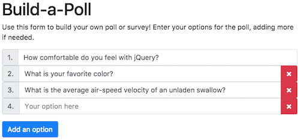

# Problem C

In this exercise, you will practice creating an interactive web page using the [**jQuery**](http://jquery.com/) library. In particular, you will practice utilizing its methods (and reading the documentation to learn more!) in order to create an interactive "poll builder" like you might find on a survey hosting site:

To complete the exercise, edit the included **`js/index.js`** file to add in the code described in the comments. Note that you ___WILL___ need to edit the HTML file to include the jQuery script!.

You can see the results of your work by opening up the included `index.html` file in a browser. Remember to refresh the page after you update your code, and to check for any errors in the Developer console.

## Resources
- [jQuery API Documentation](http://api.jquery.com/)
